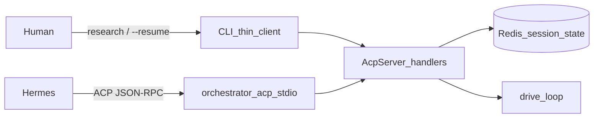

# Feature handoff: Session-driven workflows + `await_input` status

**Status:** Phase 4 complete (pack + verification) — ready for review/merge  
**Branch context:** `feat/acp-server`  
**Date:** 2026-08-06 (updated: Phase 4 pack intake checklist + resume tests)

Use this doc to continue in a new session without re-deriving the design.

---

## Problem

1. Conversational pause today is a **static** contract flag (`await_input: bool`). A step cannot decide mid-run that it still needs answers and stay put until a checklist is full.
2. ACP/CLI invent **change_id/slug** from tickets or prompt text. Session-driven runs should use **session id** and pass user text only as input.
3. Separate `acp` / `acp-run` verbs split the product. **One ACP contract** for humans and agents; CLI and Hermes differ only as clients.

## Product constraint (locked)

**Completing a started workflow does not require the same IDE/agent chat session.**  
Resume by **`session_id`** from any CLI or ACP client is enough. Same Cursor/Claude conversation is optional, not a requirement.

Implication: continuity is **Redis session state + resume**, not a long-lived chat worker. Coding/artifact steps still run via the orchestrator driver (`drive_loop` / pack steps / `models.yaml` CLIs).

---

| Goal              | Detail                                                                                                                                                                    |
| ----------------- | ------------------------------------------------------------------------------------------------------------------------------------------------------------------------- |
| Schema start      | `orchestrator research "…"` → `session/new` + first `session/prompt`; print `session_id`                                                                                  |
| Resume            | `orchestrator --resume <id> ["…"]` → load session; **same shape** for await_input answers and failed-step retries                                                         |
| Redis state       | For session workflows (`research` / `--resume`): **no durable `*_state.yaml`**. Workflow state lives in Redis; rematerialize to a temp file only while `drive_loop` runs. |
| One protocol      | Same ACP methods and payloads for CLI and Hermes (`session/new`, `session/prompt`, `session/load`, `session/close`, updates)                                              |
| Completeness gate | Step emits `status: await_input` until checklist full; only `completed` advances                                                                                          |
| Parity            | Prompt and script steps; human CLI and ACP clients hit the same handlers                                                                                                  |

## Non-goals

- Migrating `orchestrator feature ORC-*` ticket/worktree identity off change_id (separate) — those **keep** durable `*_state.yaml` on disk
- Engine auto-parsing checklists from YAML
- Fancy TUI
- A second human API (`session new|prompt` as primary UX) — schema + `--resume` is the surface
- Rewriting every `next`/`done` caller to speak Redis directly (session path uses temp rematerialize)

---

## Redis vs `state.yaml` (decision)

**Scope: session-driven ACP workflows only.** Ticket/`feature` runs unchanged (durable state.yaml).

| Layer                                           | Durable on disk?              | Role                                                                                                                                                                                                                                             |
| ----------------------------------------------- | ----------------------------- | ------------------------------------------------------------------------------------------------------------------------------------------------------------------------------------------------------------------------------------------------ |
| **`*_state.yaml`**                              | **No** (session mode + Redis) | Source of truth = Redis (`state_yaml_content` in `orc:acp:session:<id>`). On `session/prompt`: write content to a **temp** path → `drive_loop` → read back → save to Redis → discard temp. No `*_state.yaml` left under the session/repo folder. |
| **ACP session key**                             | Redis                         | Session meta + state snapshot + ask/status. Require Redis for `research` / `--resume`.                                                                                                                                                           |
| **Artifacts** (`intake.json`, `findings.md`, …) | **Yes**                       | Agent tools need files under the session workspace.                                                                                                                                                                                              |

Why temp file instead of Redis-native `load_state`: engine APIs take a path today; rematerialize keeps one code path without rewriting dispatch/record. Externally / for resume, **there is no durable state.yaml**.

---

## Already done on this branch (do not redo)

- ACP server: [orchestrator_next/acp_server.py](../../orchestrator_next/acp_server.py)
- Redis session persist when `ORCHESTRATOR_ACP_REDIS_URL` / `REDIS_URL` set (`_save_session` / `_load_session`)
- [drive_loop](../../orchestrator_next/run_loop.py) / `LoopResult` / `LOOP_PAUSED` — pauses on **status** `await_input`
- Research without Tavily; `acp-light` → cursor
- Contract `await_input` bool removed — use record status instead
- CLI: `orchestrator research` / `--resume`; `acp-run` removed; `acp` stdio kept
- Pack: `intake-research` agent step with checklist + session-local artifacts
- Tests: record, drive pause, Redis rematerialize, client resume paths

---

## Architecture: one contract, two clients



**Point of ACP:** CLI and Hermes speak the **same** methods and semantics. Difference is transport (in-process vs stdio), not a second orchestration model.

### Do you start the ACP server separately?

| Client                                  | Start `orchestrator acp`?  | Why                                                                                                                                                |
| --------------------------------------- | -------------------------- | -------------------------------------------------------------------------------------------------------------------------------------------------- |
| **Human CLI** (`research` / `--resume`) | **No**                     | CLI calls `AcpServer` handlers **in-process**. Same contracts, no subprocess, no daemon.                                                           |
| **Hermes / editor ACP client**          | **Yes — client spawns it** | Standard ACP: agent launches `orchestrator acp` as a **stdio subprocess** for the session. Not a long-running background server you start by hand. |
| **Optional daemon**                     | Out of scope               | No separate always-on ACP daemon unless a future product needs TCP/socket; Redis already holds cross-process session state.                        |

**Keep:** `orchestrator acp` as the stdio entry for machines that speak ACP.

**Remove:** `orchestrator acp-run`.

---

## CLI surface (primary)

| Command                                                    | Behavior                                                                                                                   | ACP underneath                                         |
| ---------------------------------------------------------- | -------------------------------------------------------------------------------------------------------------------------- | ------------------------------------------------------ |
| `orchestrator research "postgres optimization techniques"` | Create session; persist to Redis; run until pause/complete; **print `session_id`**                                         | `session/new` `{schema:"research"}` + `session/prompt` |
| `orchestrator --resume <id> "audience is DBAs"`            | Load from Redis; if awaiting input, apply text and continue; if runnable without input, resume; if complete, report status | `session/load` + `session/prompt` (text optional)      |
| `orchestrator --resume <id>`                               | Same load/status; continue scripts or print current ask / completion                                                       | `session/load` + prompt with empty/continue            |

Any known schema works the same way: `orchestrator <schema> "<first prompt>"`.

Ticket workflows unchanged: `orchestrator feature ORC-1` still uses ticket slug paths (not this session path).

### CLI walkthrough

```bash
orchestrator research "postgres optimization techniques"
# → session_id=a1b2c3…
# → runs intake… may pause:
# ask: Who is the audience?
# (state + ask persisted in Redis under orc:acp:session:a1b2c3…)

orchestrator --resume a1b2c3… "platform engineers and DBAs"
# → loads Redis; status await_input → inject User direction → same step
# ask: How deep?

orchestrator --resume a1b2c3… "practical ops guide"
# → intake completed → synthesize → report → status completed
```

### Hermes (same contracts)

```bash
orchestrator acp   # stdio; Hermes is the client
```

| Human intent             | ACP method (identical to what CLI calls)                                             |
| ------------------------ | ------------------------------------------------------------------------------------ |
| Start research with text | `session/new` `{cwd, schema:"research"}` then `session/prompt` `{sessionId, prompt}` |
| Answer / continue        | `session/prompt` `{sessionId, prompt}`                                               |
| Resume later             | `session/load` `{sessionId}` then `session/prompt`                                   |
| See ask / progress       | `session/update` notifications                                                       |
| Done                     | `session/close`                                                                      |

CLI implementation: thin in-process client (`acp_client.py`) calling `AcpServer.handle` — **not** a parallel driver. Hermes uses the same handlers over stdio.

---

## Session lifecycle

1. **Start:** `session/new` → UUID → persist session (+ **full state snapshot**) to **Redis**; workspace artifacts under `.orchestrator/sessions/<id>/` (no durable `*_state.yaml` there).
2. **Drive:** rematerialize state to temp → `drive_loop` → write state back to Redis → delete temp.
3. **Resume:** `session/load` reads Redis only (not a repo state.yaml); then prompt.
4. **Pause:** step `status: await_input` → do not advance; next prompt continues **same** step.
5. **Close:** delete Redis key + session artifact folder.

- `_seed_state` seeds into Redis (temp file only for the active turn).
- `change_id`/`slug`/`ticket_id` = `session_id` for `CHANGE_ID` compat in scripts.
- Drop prompt→slug sanitizer for session-driven runs.
- Redis required (`REDIS_URL` or `ORCHESTRATOR_ACP_REDIS_URL`).

---

## Status: `await_input` (completeness gate)

```yaml
COMPLETION:
  step_id: research-intake
  status: await_input
  outputs:
    ask: "Who is the audience?"
    missing: [audience]
```

| Status        | Node                     | Driver                             |
| ------------- | ------------------------ | ---------------------------------- |
| `completed`   | completed; advance       | continue                           |
| `await_input` | **same step stays next** | pause; next user text re-runs step |
| `failed`      | as today                 | not for “need more info”           |
| `blocked`     | exit 2                   |                                    |

- No retry-cap for `await_input`.
- Scripts: JSON `{"status":"await_input","outputs":{"ask":"..."}}`.
- Remove contract `await_input` bool.
- `--resume` must inspect session/workflow status before prompting (complete → report; awaiting → use provided text; else continue).

---

## Implementation checklist

1. **Record + readiness** — done (`await_input`; node stays ready; no retry cap).
2. **Drive loop** — done (pause after status; no contract pre-pause).
3. **Parser / dispatch** — done (contract `await_input` bool gone).
4. **Session + Redis state** — done (temp rematerialize; Redis required).
5. **CLI** — done (`research` / `--resume`; `acp-run` removed).
6. **Pack** — done (`intake-research` SKILL checklist; session artifact paths).
7. **Tests** — done (record, multi-turn Redis resume, client `--resume` paths).

---

## Suggested order

1. ~~`record` `await_input`~~ done
2. ~~`drive_loop` pause-after-status~~ done
3. ~~Remove contract flag~~ done
4. ~~Session directory seeding + Redis status on resume~~ done
5. ~~CLI: schema command + `--resume`; delete `acp-run`~~ done
6. ~~Pack + tests~~ done (Phase 4)

---

## Acceptance criteria

- [x] Session runs leave **no durable `*_state.yaml`**; resume works from Redis alone.
- [x] `orchestrator research "…"` prints `session_id` and stores state in Redis (Redis required).
- [x] `orchestrator --resume <id> "…"` loads Redis, respects await/complete, continues same workflow.
- [x] Hermes ACP methods are the same handlers CLI uses (no second driver).
- [x] `acp-run` gone; `acp` remains for external clients.
- [x] `await_input` keeps the same step until `completed`.
- [x] No topic-slug change_id for session-driven runs.
- [x] `feature ORC-*` still uses ticket slug paths.
- [x] Tests cover record, multi-turn, Redis resume, CLI→ACP parity.

---

## Key files

| Area                   | Path                                    |
| ---------------------- | --------------------------------------- |
| ACP server + Redis     | `orchestrator_next/acp_server.py`       |
| New ACP client helpers | `orchestrator_next/acp_client.py` (new) |
| CLI                    | `orchestrator_next/cli.py`              |
| Loop / seed            | `orchestrator_next/run_loop.py`         |
| Record                 | `orchestrator_next/record.py`           |
| Pack                   | `.orchestrator/workflows/`              |

---

## Quick start for next agent

```text
1. Read this handoff (status: Phase 4 complete).
2. Optional polish: live E2E against real Redis + agent CLI; doctor smoke.
3. Do not re-implement record/drive/Redis/CLI — already on branch.
```
